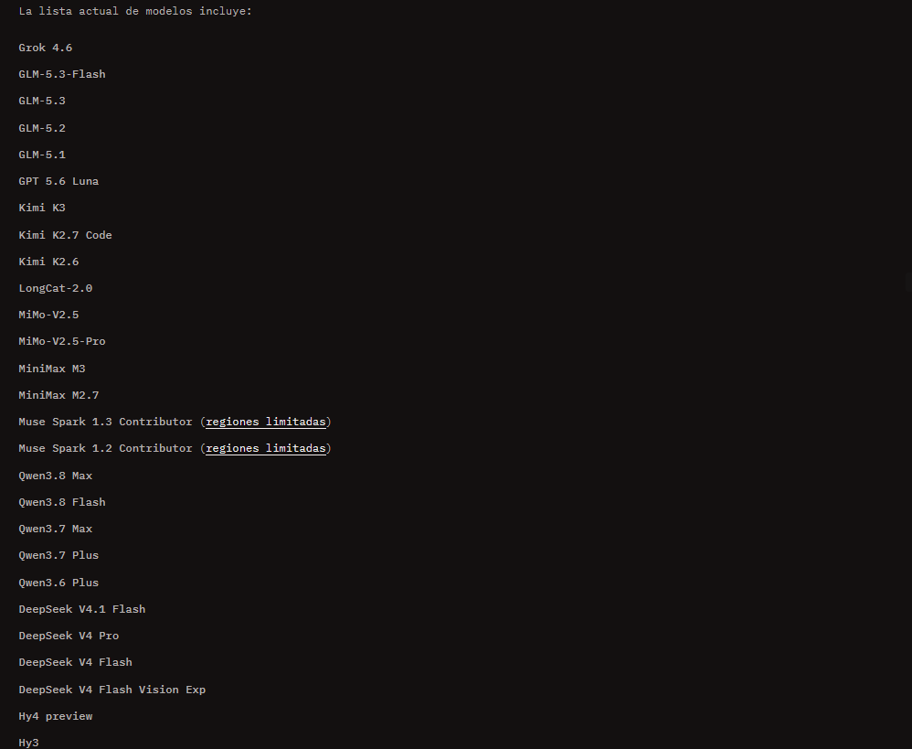
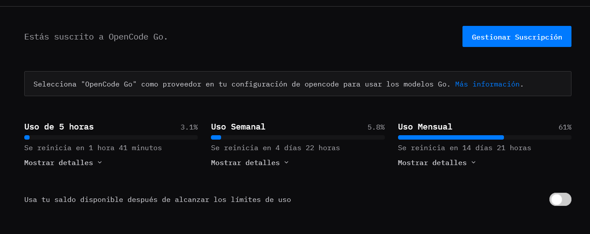
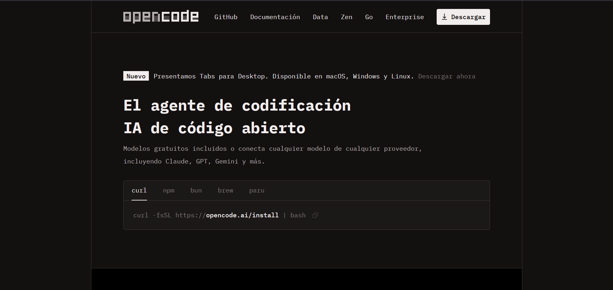
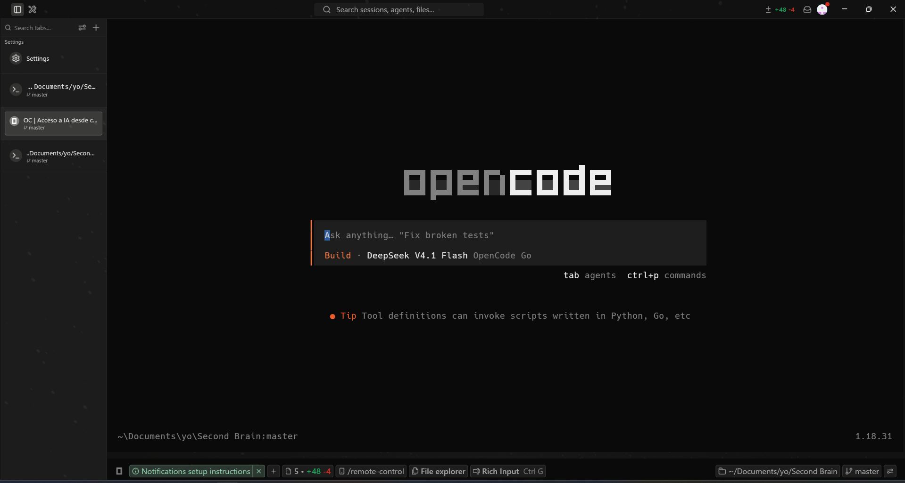
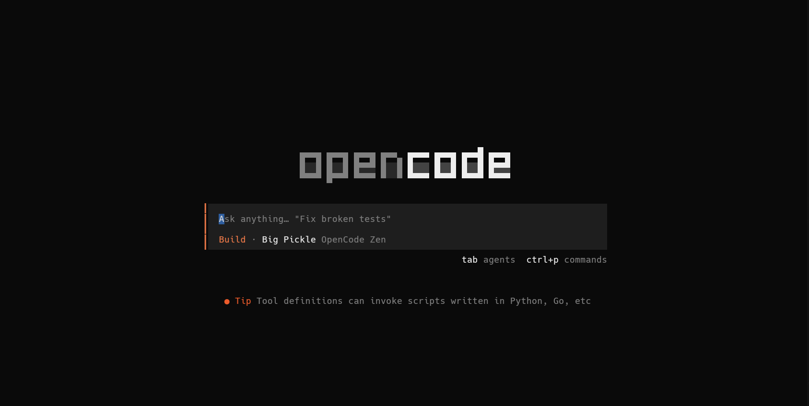
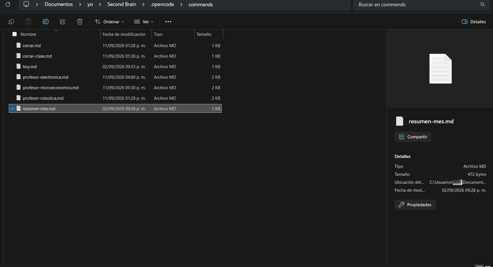
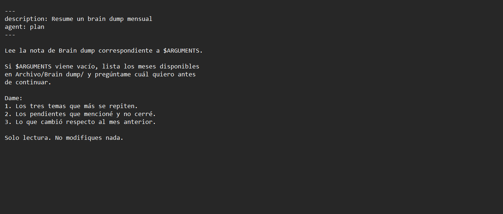
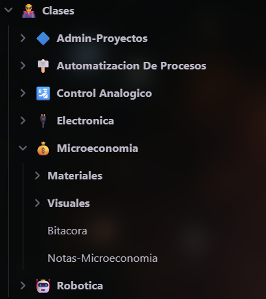

# Second Brain

Un segundo cerebro local: una bóveda de Obsidian operada por un agente de terminal.

El objetivo es que el agente pueda leer toda la bóveda (notas, documentos, PDFs, diagramas) y trabajar sobre ella respetando permisos explícitos por carpeta, con memoria persistente entre sesiones. Todo corre en local; no hay servidor ni servicio en la nube.

---

## Idea

La arquitectura se apoya en dos piezas:

1. **Obsidian** como base de datos y editor. Está construido sobre Electron (el mismo motor de un navegador), así que su interfaz es HTML/CSS inspeccionable y modificable, y todo el contenido vive en archivos Markdown en disco. Eso la vuelve compatible con cualquier herramienta de terminal y con Git. (Notion, al ser propietario y estar en la nube, obliga a pasar por una API/MCP, lo que agrega latencia y dependencia externa.)
2. **OpenCode** como agente de terminal. Corre dentro de la carpeta de la bóveda y puede leer y escribir archivos, ejecutar comandos y seguir instrucciones persistentes definidas en el repositorio.

Lo que aporta el agente sobre la bóveda sola:

- **Memoria entre sesiones.** Las sesiones de un agente están aisladas: no recuerda nada por sí solo. Todo estado que deba sobrevivir se escribe en un archivo (`Memoria.md`), que el agente lee al arrancar. Así no reconstruye el contexto desde cero cada vez (lo que cuesta muchos tokens).
- **Reglas duras.** `AGENTS.md` define estructura, permisos por carpeta y reglas de trabajo. El agente lo carga antes del primer mensaje y no puede saltárselo, lo que evita que modifique archivos fuera de su alcance o instale cosas sin autorización.

El sistema es deliberadamente local y bajo demanda. No necesita correr 24/7: los agentes se activan cuando se abre una sesión, que es cuando aportan valor.

---

## Stack

| Componente | Para qué | Costo |
| --- | --- | --- |
| [Obsidian](https://obsidian.md) | Donde viven las notas, documentos, PDFs y canvas | Gratis |
| [OpenCode](https://opencode.ai) | El agente de terminal que opera la bóveda | Gratis |
| [Warp](https://www.warp.dev) | Terminal (cualquiera sirve; esta agrega comodidades) | Gratis |
| Modelo de IA | Cualquiera con acceso por API (una suscripción de chat no basta; se necesita API key) | ~20 USD/mes, no recomendado |
| OpenCode Go | Suscripción que da acceso a varios modelos con API incluida | 10 USD/mes |
| Git | Versionado de la bóveda, sobre todo si el agente va a escribir en ella | Gratis |

### Sobre el modelo

Se pueden usar modelos de distintos proveedores. La alternativa más simple es una suscripción que ya incluya API (como OpenCode Go), porque evita crear cuenta de desarrollador, configurar facturación y conectar la clave a mano. Usar una API directa (Gemini, DeepSeek, etc.) también funciona, pero implica más pasos de configuración y facturación.



Como la mayoría de servicios, hay límites por sesión, semanales y mensuales:



---

## Instalación

### OpenCode

El procedimiento es simple: se instala desde la terminal con el instalador de la web (curl) o vía npm. Se copia el comando y se ejecuta; una vez instalado, aparece la pantalla de inicio.





Tras la instalación, el agente queda listo para usarse dentro de la carpeta de la bóveda.



### Obsidian

El proceso depende de si ya existen notas o no.

- **Bóveda nueva:** Obsidian → *Create new vault*. Conviene ubicarla en una ruta corta y fácil de alcanzar desde la terminal (por ejemplo `Documents/yo/Boveda`), no enterrada en muchas carpetas.
- **Notas provenientes de Notion:** se exportan e importan con el plugin **Importer**.

#### Migrar desde Notion

1. **Exportar.** En Notion: *Configuración → General → Exportar*. Formato **HTML**, con *Include subpages* y *Create folders for subpages* activados. Según el volumen de notas tarda entre 7 y 15 minutos; llega por correo. El enlace caduca, así que hay que descargarlo el mismo día.
2. **No descomprimir el ZIP.** El plugin lo necesita tal cual; si se abre manualmente se pierde información que usa para reconectar los enlaces internos.
3. **Crear la bóveda.** Obsidian → *Create new vault*.
4. **Instalar el plugin.** *Opciones → Community plugins → Turn on community plugins → Browse* → buscar **Importer** → *Install* y *Enable*.
5. **Importar.** `Ctrl/Cmd + P` → "Importer" → origen **Notion (HTML)** → seleccionar el ZIP → carpeta destino `Archivo`.
6. **Esperar.** No cerrar Obsidian a medias.
7. **Verificar.** Abrir varias notas al azar y comprobar texto, imágenes y enlaces internos.

#### Convenciones al organizar

- **Nombres de archivo ordenables.** Todo lo que tenga fecha se nombra `2026-08` o `2026-08-14` (año primero, mes en dos dígitos). Así el orden alfabético coincide con el cronológico.
- **Una carpeta por área activa, un archivo para lo viejo.** Lo que ya no está activo va a `Archivo/`; lo que se trabaja hoy vive en la raíz o en una carpeta que lo agrupe. Si va a haber varias cosas del mismo tipo (materias, proyectos), agruparlas desde el principio (`Clases/Robotica/` en vez de `Robotica/`), para que la raíz no se degrade con el tiempo.
- **Sin acentos ni espacios en nombres de carpeta.** Esas rutas se escriben dentro de archivos de configuración y los acentos dan problemas en la terminal.

---

## Los dos archivos que sostienen el sistema

### `AGENTS.md`

Se crea en la **raíz de la bóveda**, con ese nombre exacto: OpenCode lo busca por nombre al arrancar y lo carga antes del primer mensaje. Es una convención que varias herramientas respetan.

Un ejemplo de la estructura que se puede usar como punto de partida:

```markdown
# Contexto

Esta es mi bóveda de Obsidian: notas personales en archivos Markdown.
La uso como segundo cerebro.
Al iniciar, lee Memoria.md además de este archivo.

# Estructura

- Notas/        — apuntes y notas permanentes.
- Proyectos/    — un archivo por proyecto activo.
- Diario/       — una nota por mes, formato AAAA_MM.
- Archivo/      — material inactivo o terminado.
- Recursos/     — imágenes y adjuntos.
- Pendientes.md — lista de cosas por hacer.
- Memoria.md    — memoria del agente entre sesiones.

# Permisos por carpeta

- Archivo/      — solo lectura. NUNCA modificar.
- Notas/        — lectura y editable.
- Recursos/     — solo lectura.
- Proyectos/    — lectura y editable solo si te lo pido explícitamente.
- Diario/       — lectura y editable solo si te lo pido explícitamente.
- Pendientes.md — puedes modificarlo y agregar cosas, editable si te lo pido.
- Memoria.md    — editable.

# Reglas

- NO renombres ni muevas archivos: se rompen los enlaces.
- Puedes editar el contenido de las notas, nunca sus nombres ni rutas.
- Las fechas van en formato AAAA-MM o AAAA-MM-DD.
- Los enlaces se escriben con dobles corchetes y ruta completa desde la raíz.

# Cómo trabajar

- Antes de cualquier cambio, muéstrame qué vas a hacer y espera mi aprobación.
- Si algo es ambiguo, pregunta en vez de asumir.
- Cuando acabes, repasa los cambios y repórtalos.
```

Puntos a cuidar:

- **Los permisos se escriben explícitamente.** Si solo se describen las carpetas en prosa, el agente deduce los permisos por su cuenta y a veces deduce mal: lo que no está explícito, se inventa.
- **Pedir dos reportes, no uno.** El plan dice lo que se iba a hacer; el reporte final, lo que se hizo. No siempre coinciden, y esa diferencia es donde aparecen los errores.
- **Usar comodines cuando aplique** (`Clases/<Materia>/Materiales/ — solo lectura`) para que el archivo escale solo cuando se agreguen carpetas nuevas.
- **Mantenimiento:** cada pieza nueva se anota el mismo día. Si no, en un mes el archivo describe una bóveda que ya no existe.

### `Memoria.md`

Vive también en la raíz y es lo primero que el agente lee. Como las sesiones no comparten memoria, este archivo es el único lugar donde puede persistir el estado.

Versión mínima:

1. Un archivo `Memoria.md` en la raíz, con secciones vacías.
2. Un comando `/cerrar` que al final de la sesión proponga qué agregarle.

Tres reglas para que no se degrade:

- **Máximo tres líneas por sesión.** Sin límite, se llena de obviedades en dos semanas.
- **Solo lo que se repite o lo que se corrigió explícitamente.** Nada que haya pasado una sola vez.
- **Repaso periódico de poda, no de agregar.** Como el agente no percibe el paso del tiempo, se guarda un campo `Último repaso` con fecha; el agente la compara con el mes actual. Eso convierte algo que no puede saber en algo que puede leer.

Criterio de qué entra: **si una línea no cambia lo que el agente hará mañana, no debería estar ahí.** La memoria no es un registro histórico.

Y la línea que activa todo, dentro de `AGENTS.md`:

```markdown
- Al iniciar, lee Memoria.md además de este archivo.
```

Sin esa línea el archivo existe, pero nadie lo abre.

---

## Comandos y agentes

Si se ha usado OpenCode, Claude o ChatGPT, las funciones que se invocan con `/` son **comandos**: funcionan como una función en cualquier lenguaje. Se crea un archivo `.md`, se guarda en `.opencode/commands/` y ahí se escriben los parámetros que quieren repetirse cada vez que se invoque.

Carpeta de comandos:



Contenido de un comando:



Así, teclear `/resumen-mes` activa esa secuencia y devuelve el resultado pedido.

La distinción:

- **Un comando** vive en `.opencode/commands/` y es una instrucción que se ejecuta y termina. El nombre del archivo es el nombre del comando: `resumen-mes.md` se invoca con `/resumen-mes`.
- **Un agente** vive en `.opencode/agents/` y es una *personalidad* en la que se entra: tono, permisos, configuración del modelo. Se mantiene durante toda la conversación.

Puntos a cuidar:

- **El frontmatter debe empezar en la primera línea del archivo.** Un renglón en blanco antes y no se reconoce; tampoco se lee el `agent:`, así que el comando corre sin personalidad. Señal de que quedó bien: la descripción aparece en gris junto al comando al escribir `/`.
- **Cuándo usar cada uno.** Comando si es una tarea de una sola pasada. Agente si hay estado que continúa entre sesiones y se quiere una personalidad estable. No todo merece personalidad.
- **Dos ajustes que valen:** `agent: plan` pone el comando en solo lectura (no es una sugerencia, es un candado a nivel de herramientas), útil en todo lo que solo consulta. Y `temperature` controla cuánta libertad se toma el modelo: bajo (0.3) se apega al material, alto improvisa; para enseñar o consultar, bajo.
- **`$ARGUMENTS`** se sustituye por lo escrito al invocar el comando. Si se quiere que el comando ofrezca opciones, conviene agregar "si `$ARGUMENTS` viene vacío, lista lo disponible y pregúntame": sale mejor que un menú fijo, porque la lista se genera desde los archivos reales.

---

## Ejemplo: un agente profesor

Un profesor de IA que da clase sobre un libro real, lleva registro de dónde te atoraste y pregunta temas viejos sin avisar.

Estructura de carpetas:

```
Clases/<Materia>/
  Materiales/        → el libro o material (syllabus, ejercicios). Solo lectura.
  Visuales/          → diagramas o visuales que genera la IA (Mermaid o SVG).
  Bitacora.md        → registro del profesor. Solo lo escribe él.
  Notas-<Materia>.md → apuntes del usuario. Solo los escribe él.
```



**Un agente genérico, un comando por materia.** El agente lleva la personalidad; el comando aporta las rutas. Así, cuando se afina la personalidad, se corrige en un solo lugar y aplica a todas las materias. Con un agente por materia habría que repetirlo cada vez.

Decisiones de diseño:

- **El material tiene que ser legible.** Un libro en PDF con texto real sirve; un curso en video dentro de una plataforma no. Sin texto real, el profesor improvisa desde lo que el modelo recuerde y se pierde la ventaja.
- **Las respuestas van separadas del contenido.** Si las soluciones están en la misma carpeta o archivo, el profesor las ve al abrir el tema y guía hacia ellas sin querer. Pedirle que no las mire es más débil que separarlas.
- **Los apuntes los escribe el usuario.** Escribir es parte de aprender; si el agente los redacta, se elimina el trabajo que fija el conocimiento. Él los lee y los corrige.
- **No cargar archivos completos.** Leer un PDF de cientos de páginas agota el contexto y cuesta caro. La instrucción es abrir solo el capítulo que corresponde.
- **Los visuales salen como archivos, no como respuesta.** La terminal no muestra imágenes: el profesor escribe un diagrama Mermaid o SVG como nota y se abre en Obsidian.
- **Diagnóstico antes de clase.** Si ya se vio parte del temario, la primera sesión no da clase: pregunta para encontrar los huecos reales y los anota. Las siguientes solo cubren eso.

---

## Cosas a tener en cuenta

Cada punto siguiente costó tiempo real.

1. **Renombrar archivos desde la terminal rompe los enlaces.** Cuando Obsidian renombra, actualiza las notas que apuntaban al archivo; cuando lo hace un agente en la terminal, solo cambia el nombre: los enlaces quedan apuntando a algo que ya no existe. Regla general: **el agente edita contenido, la persona mueve estructura.** Nombres y ubicaciones se cambian desde Obsidian.
2. **Elegir mal los primeros prompts.** Un buen primer encargo cumple tres cosas: que ya lo harías a mano, que da flojera y que **puedes verificar de un vistazo**. El renombrado masivo falla en la tercera: el daño es invisible hasta que días después se da clic en un enlace muerto. Mejores primeros encargos: listar, resumir, encontrar duplicados. Todos de solo lectura.
3. **Confiar en un respaldo viejo.** El respaldo debe ser **justo antes** de cada operación masiva, no el de hace dos horas: sirven en proporción a qué tan recientes son. Git dentro de la bóveda da el diff exacto de qué cambió y permite revertir un cambio que tocó veinte archivos de un golpe. Se configura en media hora, más un `.gitignore` para excluir la carpeta de plugins y los archivos pesados.
4. **Pedir formatos estructurados al agente.** En prosa el agente no puede romper nada; en formatos estructurados sí, porque o están perfectos o el archivo no abre. Un carácter fuera de lugar en el JSON de un Excalidraw lo corrompe. Si se quiere un diagrama, pedirlo en **Markdown** (lista con sangrías) o en **Mermaid** (texto plano que Obsidian dibuja solo): un error de sintaxis ahí solo se ve feo, no destruye el archivo.
5. **Usar el modelo caro para todo.** Reorganizar archivos es mecánico y no necesita el modelo más capaz; leer un libro completo cuesta lo mismo que cien conversaciones normales. Modelo ligero para lo mecánico, pesado para lo que pide criterio; y que el agente abra capítulos, no libros.
6. **Dar permisos amplios.** Cuando el agente pide salirse de la carpeta de trabajo, rechazar por defecto. Si no se entiende por qué lo quiere, no se le da. "Permitir siempre" abre esa ruta para siempre.
7. **Montar agentes que no se van a usar.** Montar el agente el día que se va a usar por primera vez, no antes. Cinco bitácoras vacías se sienten como un sistema abandonado aunque todo funcione.

### No ampliar el alcance del proyecto

- **Un servidor corriendo siempre.** El segundo cerebro no necesita estar encendido porque nadie piensa todo el tiempo; los agentes se disparan al abrir sesión, que es cuando sirven. Un servidor 24/7 además consume muchos tokens. Si se quisiera, conviene un modelo económico o uno local (Gemma, Qwen 8B, etc.).
- **Un framework de orquestación.** Sirve cuando hay agentes que se llaman entre sí. Con tres comandos independientes no hay nada que coordinar. Se llega a eso, no se empieza por ahí.
- **Duplicar algo que otro producto ya hace mejor.** Si lo que se quiere es un resumen en audio de unos videos, hay herramientas gratuitas que lo hacen mejor. Lo que este sistema hace y ninguna herramienta puede es **cruzar cualquier cosa contra lo que tú escribiste**, porque nadie más tiene esas notas.

---

## Plugins de Obsidian recomendados

- **Importer:** oficial, para migrar desde Notion. Se usa una vez.
- **LaTeX Suite:** si se escriben matemáticas. Obsidian ya dibuja ecuaciones con `$...$`; el plugin agrega **velocidad** (se teclean dos caracteres y sale la fracción armada).
- **Excalidraw:** dibujos a mano alzada. Relevante para este proyecto porque desde la versión 1.2 guarda los dibujos como Markdown con una sección de elementos de texto, así que las etiquetas de los diagramas son legibles para el agente.
- **Style Settings:** si se usan temas. Muchos temas modernos son sobrios de fábrica y su personalización vive en el panel que agrega este plugin; sin él se queda el aspecto por defecto.
- **Transcripción de voz:** si se quiere, elegir una que transcriba **en la computadora**, no una que mande el audio a una API. Existen las dos; la local no cuesta ni sale de la máquina.
- **Tasks:** para poner casillas como lista de pendientes.

---

## Plantillas

La carpeta `plantillas/` contiene un punto de partida funcional:

```
plantillas/
├── AGENTS.md
├── Memoria.md
└── .opencode/
    ├── .gitignore
    ├── agents/
    │   └── profesor.md
    └── commands/
        ├── cerrar.md
        ├── cerrar-clase.md
        ├── hoy.md
        ├── resumen-mes.md
        ├── profesor-robotica.md
        ├── profesor-electronica.md
        └── profesor-microeconomia.md
```

Cómo usarlas:

1. Copia `AGENTS.md` y `Memoria.md` a la raíz de tu bóveda.
2. Copia la carpeta `.opencode/` también a la raíz (incluido su `.gitignore`, que evita que `node_modules` acabe en tu repositorio).
3. Ajusta la estructura y los permisos de `AGENTS.md` a tus carpetas reales.
4. Abre OpenCode dentro de la bóveda y prueba un comando de solo lectura (`/resumen-mes`). La descripción debe aparecer en gris junto al comando al escribir `/`.

Los comandos `profesor-*` son ejemplos de cómo queda un comando lleno para una materia; se conectan con el agente `profesor.md` y con la estructura `Clases/<Materia>/`. Si tu materia no usa el mismo material, sirven igual como plantilla: cambia rutas y nombres.

---

## Estado

Completo y en mejora constante. La estructura descrita aquí es suficiente para correr el sistema en local.
